Authors:

Yalun Qin([allenchin1990@gmail.com](mailto:allenchin1990@gmail.com))

Yuxiang Wang([jdit89@gmail.com](mailto:jdit89@gmail.com))

# 1 Introduction

Virtual reality is a form of technology that creates computer generated worlds or immersive environments which people can explore and in many cases, interact with.  There are many VR systems being used in areas like education, gaming, architecture and military. One important characteristic that all of the existing VR systems share is the ability to allow the user to view 3D images, which change as the user moves around their environment that corresponds with the change in their field of view. To join the user's head and eye movements and the appropriate response(e.g. change in perception)  seamlessly is one aim of many VR systems, which ensures that the virtual environment is both realistic and enjoyable. To achieve this, head tracking is very crucial, which is typically implemented as a head mounted device, like Oculus Rift. This kind of head tracking is indeed quite accurate, and by embedding the display inside the headset it can give the user a very high degree of immersion. However, in the area of gaming, the bulky headset may not be very well suited, especially for games that requires frequent and fast movements. Inspired by Johnny Lee's demo of desktop VR display using WiiRemote, we came up with a new way to implement head tracking without using any head mounted devices, or even without WiiRemote. The only tracking hardware needed is a camera, which could be the built-in webcamera of the laptops.  One big drawback of this method, compared to other head tracking methods, is the range of allowed rotation angle is much smaller and the location of head must be within the field of view of the camera. However for most of the games running on the desktop, we believe that this range is big enough to provide the user in front of the screen with a good VR experience.  Based on this head tracking method, we developed a VR ball game that let the user "blow" the  virtual bouncing ball in a 3d virtual room. 

# 2 Application Overview

Our application is based on the VR display implemented in our third assignment, which enables the user to view an artificial 3D scene by moving his head. The 3D scene we are going to implement consists of a big 3D room, some randomly generated targets, a ball and flying missiles. It is a physical environment, so all of the virtual objects in it are affected by forces like gravity. The goal of the game is to destroy all the targets by blowing the ball and let the ball hit the targets. There will also be some missiles flying towards the user, and he must dodge them by moving his head. Game will be over if the user is hit by the missile. 

Figure 1. Main scene in the Unity3D game. The yellow fire ball is the ball the user is going to hit. The blow circle indicates the user’s blowing direction. The fixed red and white balls are the targets. The black missile flying towards the user is the object he must dodge. 

# 3 Implementation

## 3.1 System Overview

* Operating system: Currently only on Windows, but the code is portable to other desktop operating systems like Linux and Mac OS. 

* Dependencies and libraries: 

* OpenCV, Boost, dlib,  eigen, tbb, CLM, FaceAnalyser, all wrapped up in CLM-Framework(the face tracker).

* Unity3D 5.

## 3.2 System Architecture

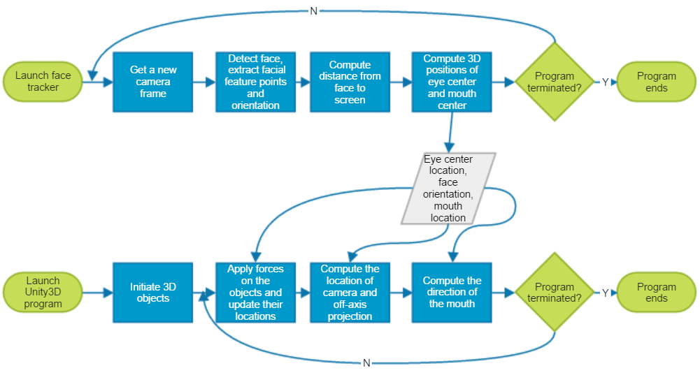

Figure 2. System architecture

As is shown in the figure above, our system consists of two programs running in parallel. One is the face tracker, which should be the first one to run and keeps reading data from camera, outputting eye center location, face orientation and mouth location to the server(in our case is the local host). The second program is the Unity3D game program, which is the main program that the user interacts with. It keeps receiving data from the server and updates all the virtual objects according to the received data. 

## 3.3 Face tracking

Face tracking is a very crucial step in our application. The robustness and speed of our application is highly dependent on the face tracker. We found the Cambridge face tracker[2] suits our needs best, since it gives us 3d locations of eyes and mouth, as well as a stable orientation of the face. It is also quite robust, in the sense that it allows about 20 degrees of head rotation about x and y axis(in OpenCV coordinate system), and quite a large rotation about the z axis, under various reasonable lighting conditions. It also has a good real time performance, which achieves 30FPS in the best case.

After we got the 6 degrees information of the face, we can estimate the distance from the user’s face to the screen. According to the perspective projection equation , we have:

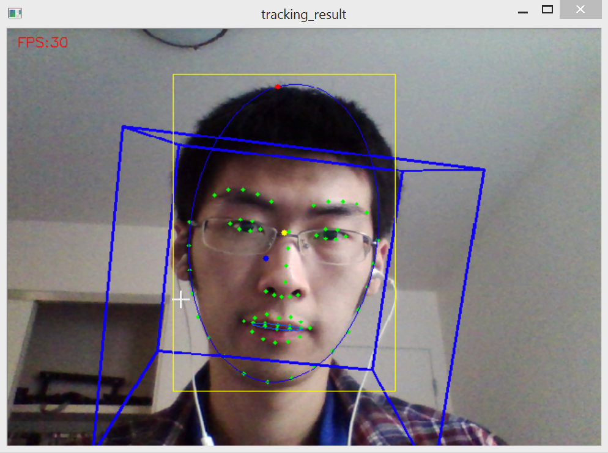

Figure 3. Face tracking result(frontal face). Green dots are the 68 tracked facial feature points, and the two light blue ellipses are fitted to the points around the face and the inner mouth points, respectively. The yellow rectangle is the bounding box of the rotated rectangle of the larger ellipse, and the center of it is indicated by the yellow dot. The blue cube indicates face orientation. The red and blue dots indicate the locations of the user’s eye center and mouth center projected on the screen. 

(u, v) is the coordinate in the image space and (x, y, z) is the coordinate in the 3D camera space. fx, fy is the focal lengths of the camera, and (cx, cy) is the coordinate of principal point. We assume that the user has provided these parameters in an input file. Since fx and fy are usually very close to each other, we can use their average value fa instead of the two different values. Therefore we computed the distance as:

faceMeasure is the distance between two face points in the world space, and virtualMeasure is the distance between two corresponding face points in the image space. Since virtualMeasure is a denominator, small change of this value may lead to large change of z, therefore we need to make sure that this value does not flicker too much, in order to make the computed z as stable as possible. We tried to simply choose two tracked facial feature points and calculate virtualMeasure between them, but since the feature points are flickering all the time, the computed z flickered quite seriously. 

To solve this problem, we fitted an ellipse to the points around the face. The fitting process is very robust to the noise of each of the points, and the resultant width and height of the fitted ellipse is quite stable. We chose to use width as the virtual measure instead of height because we noticed that the height of ellipse changed a lot as the user changed his facial expression or raised or lowered his head, however the width stayed almost the same, which is what we want since we don’t want z be affected by those movements. 

## 3.4 Off-axis Projection

Given the computed z value and image coordinate, as well as camera intrinsic parameters, we then computed the location of eye center in the world space based on equation (1) and (2). Theoretically, the image coordinate of eye center should be the average of all the eye points. However in reality this would lead to the result that when the user turns his head sideways, the location of eye center in the image space will change a lot, which makes the 3D virtual scene change a lot too. In order to reduce the influence of this, we adjusted the x coordinate of calculated eye center to be equal to that of the center of bounding box(the yellow dot in Figure 3).  Note that the origin here is camera, and we can easily convert the coordinate to the space with the origin at the screen center by using a simple transformation, based on the location of the screen center relative to the camera. All the measurement here and in the following processes are in centimeters. 

Having obtained the location of eye center in world coordinates, the next step is to set up the camera based on off-axis projection, which is essentially generalized perspective projection[3]. 

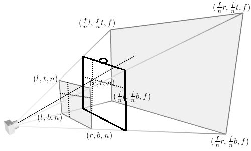

Figure 4. Perspective viewing frustum[5]. Black square represents the screen.

To compute the projection matrix, we need to compute the location of left, right, top, bottom, near and far clipping planes, represented by l, r, t, b, n, f, respectively in Figure 4. Note that n and f are set manually, in our case we chose 0.5 and 1000. The rest of parameters are calculated using n, f, as well as the height and width of the screen, since we need to make sure the near plane matches the user’s screen.

ratio = n / (-z)

l = (-screenWidth / 2 - x) * ratio

r = (screenWidth / 2 - x) * ratio

t = (screenHeight / 2 - y) * ratio

b = (-screenHeight / 2 - y) * ratio

(x, y, z) is the location of eye center in the world coordinates.

Then the projection matrix is computed as follows(derivation of it can be found at [3] and [6]):

## 3.5 Blow simulation

To simulate the mouth blow action, we need the position and orientation of mouth, as well as a flag indicating whether the user is blowing or not.  We could simply use the mean of inner mouth points to calculate the position of mouth, but that way the position of mouth would change a lot when the user changes the shape of his mouth. To make it invariant to the shape of the mouth, we estimated the location of mouth by first fit a line to the four eye corners(the blue line in Figure 5), and then calculate the length of the line segment formed by the four points on the nose(d).  The estimated location of mouth is 2*d from the location of eye point mean, in the direction perpendicular to the blue line(yellow dot in Figure 5). 

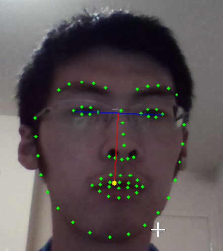

Figure 5. Estimation of mouth location

This method can give a stable location of mouth which is invariant to the shape of mouth, however it sacrifices some accuracy, as can be seen from the right image of Figure 5. But in practice we found that this is actually not a big issue, since the user won’t be able to rotate his head horizontally to a large angle due to the limitation of the face tracker, and it can hardly be recognized by the user with just a few pixels of shift. We then computed the 3D location of it using same method as eye center. 

Since we assume that the blow direction is the same as the orientation of the face, we simply used the pitch, yaw and roll angles returned by the face tracker to estimate the direction. To visualize this, we rendered a virtual capsule indicating the blow direction(see 3.8 for details). 

To detect whether the user blows or not, we fitted an ellipse to the inner mouth points and check whether the ratio of its height to width is bigger than a threshold. If a blow action is detected, then we check whether the virtual ball is blown or not. We did this by modeling the blow rangle as a cone and set the opening angle to be some value, and then check whether the ball is inside it or not. We haven’t implemented the visualization of the cone yet, but it doesn’t matter much since the user only needs to know where he is blowing at and he can gradually feel the blowing rangle as he is playing the game. The blow force is inverse linear to the distance between the mouth and the ball.

## 3.6 Unity3D framework

We use Unity3D engine to build our game. Unity3D engine is a well-used game engine that has cross-platform compatibility, which allows us to build the game once and being able to run the game on different platforms, such as PC, Android and Xbox. Furthermore, Unity3D engine integrates a powerful scene builder inside, which can import various kinds of resources and allows the developers to easily build complicated scene. The script on the scene objects is based on C# with APIs from Unity, makes it easier to learn and use. On graphics and simulation side, Unity3D engine has a powerful lighting system with real-time global illumination, as well as physics engine to simulate rigid body or fluid interactions.

We learned Unity3D from scratch and build the game in less than two weeks. Though it is somehow coarsely done, it proved that Unity3D is easy to use and could be a good platform either for fast prototyping of research project, or serious 3D/AR/VR application development.

**3.7 Scene setup**

The basic setting of the scene is rather simple: we build a tunnel using simple cuboids. We use the data from the face tracker to adjust the size and position of the cuboids in order to make the tunnel to fill the screen.

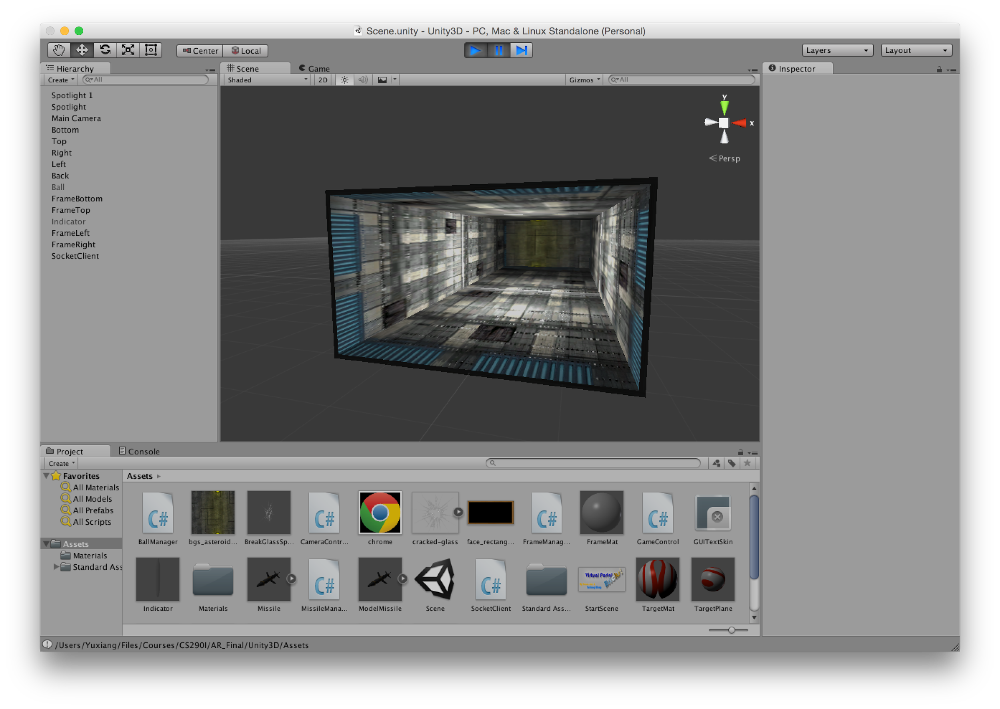

Figure 6. Unity3D editor, and the basic scene setting.

Serious tuning on lights and textures could make more astonishing result, however, we lack the experience of being a game artist so we did that in a simpler way. We set the cuboids with textures we found online, and used two point light in the middle of the tunnel to light up the whole scene.

Figure 7. Scene with game ball and targets lit by point lights, from editor view.

To win the game, the player needs to use the game ball the hit all target spheres in the tunnel. We use a script to generate the targets. When the game is started, the script generates 7 targets and corresponding "poles" for the targets at random positions inside the tunnel. The game ball is an object with rigid body feature provided by Unity3D, it can respond to a force given to it, as well as affected by gravity. All objects in the scene are set to bouncy physical material, so when the ball hit another object (e.g. the targets or the walls), it can bounce off from it. Those physical simulations are all done by Unity3D. When the ball hits a target or pole, a script will be called to destroy the target object.

To make the game more fun, we add a feature: missiles would be generated at the end of the tunnel, and the player needs to dodge the missile by not letting the missile hit the projected face on the screen. We set up a timer in the script the generate the missile, and set the X-Y coordinate of the missile as the current X-Y coordinate of the camera in world space. The world space position of the missile is updated on frame-by-frame basis, and we check if the missile has arrived the other end of the tunnel, then see if it hits the current face position (camera position) when it arrives.

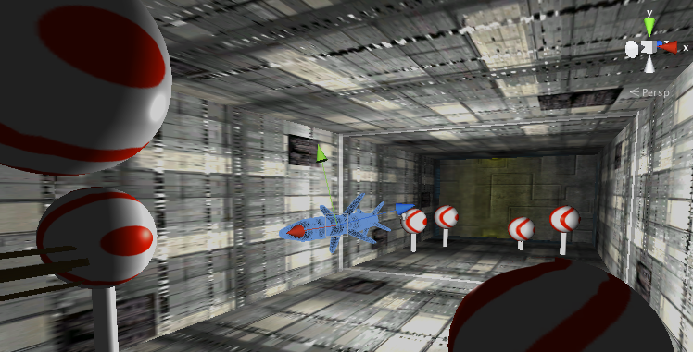

Figure 8. Missile in flight, in scene editor view.

Our face tracker is written in C++, so we need to communicate between the face tracker and Unity3D application. In order to do so, we run the face tracker separately in background, and the face tracker would send tracking data to localhost (127.0.0.1) using UDP protocol. On Unity3D side, we use a script to listen to the corresponding port and parse the received package, then use the data to adjust the camera position and projection matrix.

**3.8 Visual Indicators**

During the development of the game, we found that comparing to the traditional 2D brick breaking game, we need more visual indicators in this 3D scene. 

The first thing we noticed is that the player may lose depth perception in this tunnel scene. It is hard for the player to know where the ball is in tunnel and it is easy to let the ball fly out of the tunnel. To fix this we added a transparent frame in the tunnel indicating the depth of the ball. The frame is set to transparent material and sticks to the wall; it is bounded to the ball, so the z coordinate of the frame equals to ball's. This frame would give the player a clue of the depth of the ball.

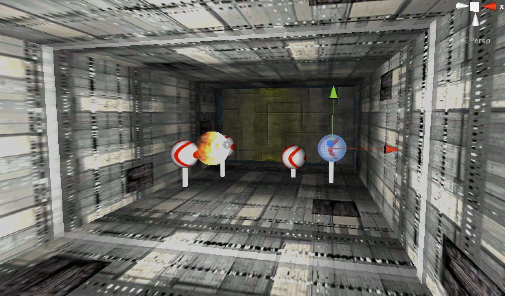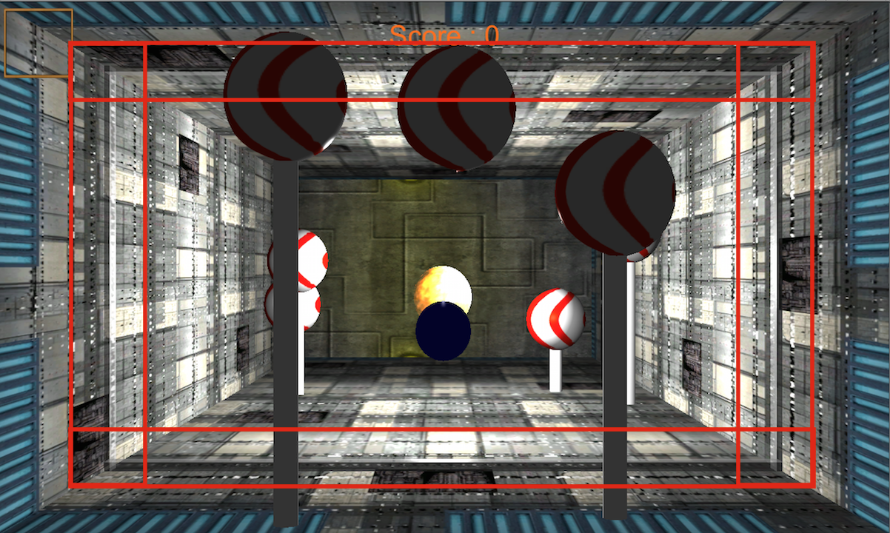

Figure 9. Left: depth indicator (the transparent frame) in editor view. Right: depth indicator in real game play, as highlighted.

Another issue is that the player needs to know which direction he/she is blowing the ball. We read the face position from the face tracker, then create a capsule-shaped mesh pointing from the face position tunnel, and the orientation of this mesh is determined by the data transferred from the face tracker, indicating the direction that the user is blowing the ball to. The collider of this indicator is disabled, so it would not affect the bounce of the ball. The color of the capsule indicates the mouth status---blowing(yellow), not blowing(blue), or blowing and hitting the ball(red). Similarly, we also draw a texture of frame at the face position on screen.

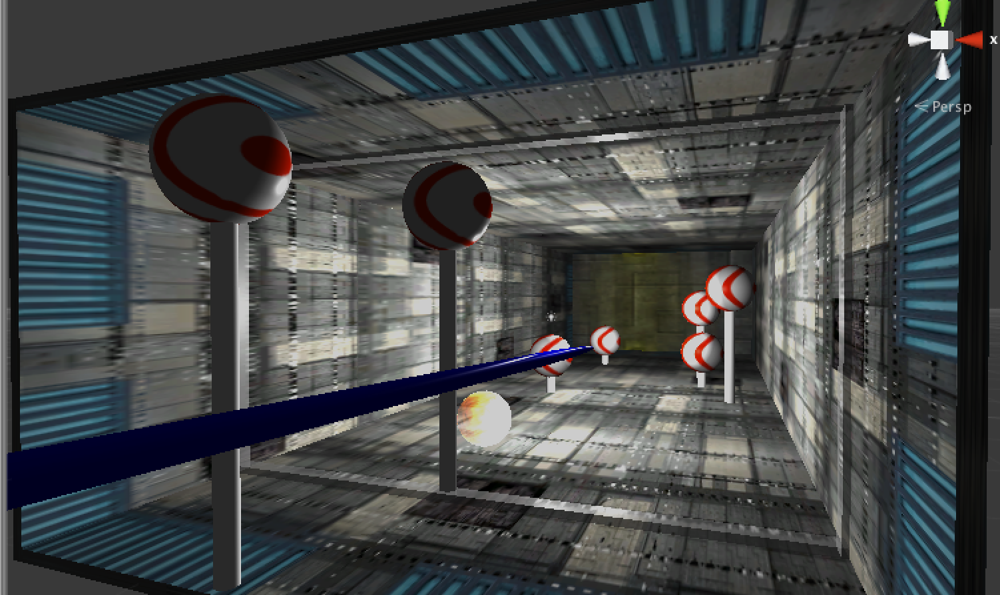

Figure 10. Left: blow direction indicator (long cylinder) in editor view. Right: blow direction indicator in real game play.

When the ball is out of the tunnel or a missile hit the player, we would like to see some special effect to can make the game more immersive. So when the ball is out or the missile hit the end of the tunnel, we put a 2D sprite of broken glass at the hit position: it looks like the screen is broken by the ball or missile.

 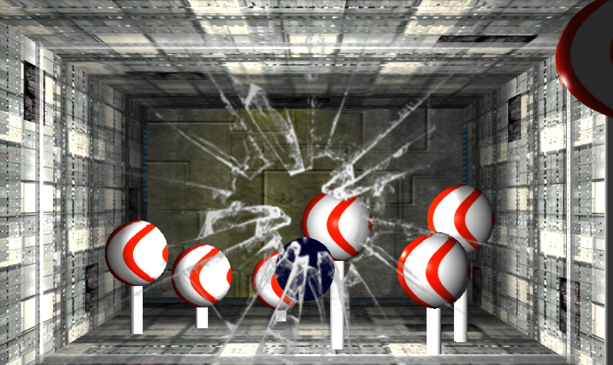

Figure 11. Glass breaking effect.

**3.9 Game Logic**

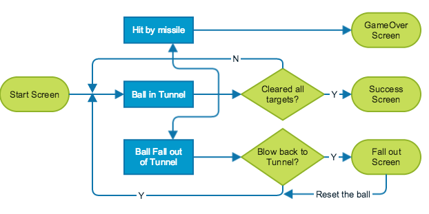

Figure 12 . Game logic flowchart.

The game starts from a start screen. After the player clicks "Start Game" button, the ball is released to the tunnel and the player could blow the ball to hit the targets. When all the targets are eliminated, it will jump to the success screen, and the player could click the button to start another round. When the ball falls out of the tunnel, the fall out screen would show up and a “Reset ball” button would also appear. The player still have the chance to blow the ball back to the tunnel, but clicking the button would reset the ball to the initial position. If the player is hit by the missile, the game will immediately jump to game over scene, and the player could restart the game by clicking the button. 

# 4 Results

# 5 Project Management

* Face tracking --- Yalun Qin

* Off-axis projection --- Yalun Qin

* Blow simulation --- Yalun Qin

* Unity 3D scene setup --- Yuxiang Wang

* Visual indicators --- Yuxiang Wang & Yalun Qin

* Game logic --- Yuxiang Wang

# 6 Summary

In this project we implemented a VR ball game which gives the user some levels of virtual reality experience using only a built-in webcamera.  Generally speaking we are satisfied with the result we’ve achieved, since our application presents a good real-time performance under most of reasonable lighting conditions. However it still has some limitations.

The first one is about the real-time speed. We noticed that if the user’s face is not well-lighted compared to the background, the frame rate will drop to about 15FPS, which is half of the best frame rate. Also even in the best case when the frame rate is around 30FPS, if the user moves his head too fast, the tracker may not be able to track the face in time, resulting in a delay of the rendered virtual scene. 

The second limitation is about the orientation returned by the face tracker, which is flickering all the time, resulting a flickering blow indicator. This is not a very serious issue in our application since compared to other face trackers we’ve found, this one gives the most stable face orientation data, not flickering very seriously. We want to point this out just to remind the reader that this is one thing that could be improved. 

The third one is the limitation of rotation angles. This is the most obvious drawback of our method compared to others using head-mounted devices. Also those devices can often give a more stable output than our face tracker. 

As you can see, all of the above limitations are actually caused by the face tracker. Therefore the best way to improve the performance of our application is to improve the face tracker, making it more fast and give more stable tracking result.  Another easier way of improvement is just making use of more powerful hardware, like Kinect, Wiimote or any other head-mounted trackers. This replacement can be easily achieved in our application since the tracking part has already been separated from the rendering part. 

# References

[1] [http://www.vrs.org.uk/](http://www.vrs.org.uk/)

[2] CLM-Framework(Cambridge Face Tracker) developed by Tadas Baltrusaitis, [https://github.com/TadasBaltrusaitis/CLM-framework](https://github.com/TadasBaltrusaitis/CLM-framework)

[3] Kooima, R., "Generalized perspective projection", 

[http://csc.lsu.edu/~kooima/pdfs/gen-perspective.pdf](http://csc.lsu.edu/~kooima/pdfs/gen-perspective.pdf)

[4] David E. Johnson , "Projection and View Frustums", http://www.cs.ucsb.edu/~holl/CS290I/Assignments/Assignments-3/frustum.pdf

[5] [http://www.songho.ca/opengl/gl_transform.html](http://www.songho.ca/opengl/gl_transform.html)

[6] [http://www.songho.ca/opengl/gl_projectionmatrix.html](http://www.songho.ca/opengl/gl_projectionmatrix.html)

[7] [http://docs.unity3d.com/ScriptReference/Camera-projectionMatrix.html](http://docs.unity3d.com/ScriptReference/Camera-projectionMatrix.html)

[8] OpenCV Documentation [http://docs.opencv.org/](http://docs.opencv.org/)

[9] Explaination and example code at [https://msdn.microsoft.com/en-us/library/windows/desktop/ms740120%28v=vs.85%29.aspx?f=255&MSPPError=-2147217396](https://msdn.microsoft.com/en-us/library/windows/desktop/ms740120%28v=vs.85%29.aspx?f=255&MSPPError=-2147217396)

[10] Explaination and example code at https://msdn.microsoft.com/en-us/library/windows/desktop/ms740148(v=vs.85).aspx

[11] [http://www.andysaia.com/radicalpropositions/unity-3d-faceapi-love/](http://www.andysaia.com/radicalpropositions/unity-3d-faceapi-love/)

[12] [http://unity3d.com/learn/tutorials/modules](http://unity3d.com/learn/tutorials/modules)

